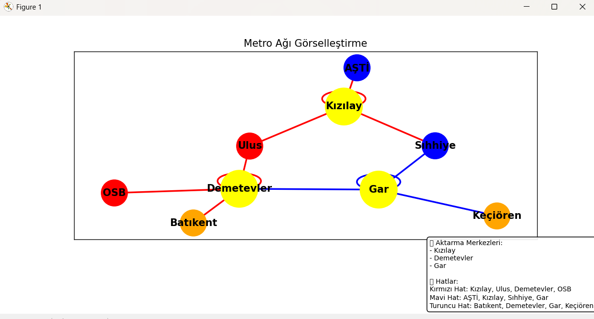
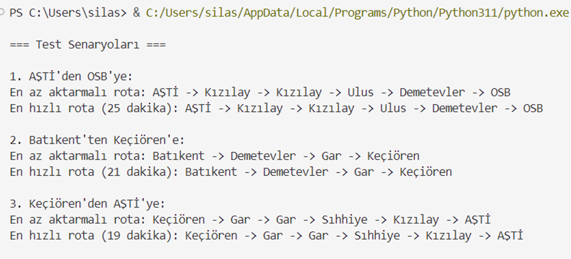
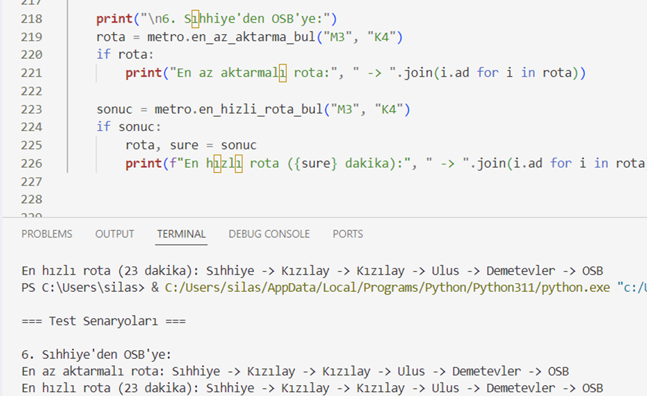
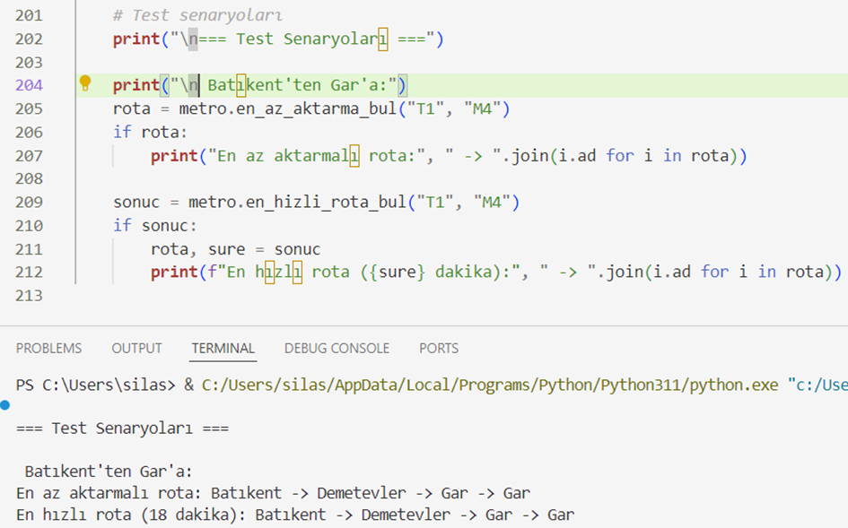

### 1. Proje Başlığı ve Kısa Açıklama

Bu proje, bir şehirdeki metro istasyonları arasında hem en az aktarmayla hem de en hızlı şekilde yolculuk yapmayı sağlayan bir rota bulma uygulamasıdır.
Kullanıcı başlangıç ve hedef istasyonu girdikten sonra:
---En az aktarma yaparak gidilecek rotayı (BFS algoritması) ile bulur.

---En kısa sürede gidilecek rotayı (A algoritması*) ile hesaplar.

### 2. Kullanılan Teknolojiler ve Kütüphaneler
Programlama Dili
--- Python 3.11

Kullanılan Kütüphaneler
---`collections`
---`deque`: BFS (Breadth-First Search) algoritmasında kuyruk yapısı için kullanıldı.
---`defaultdict`: Hatlara göre istasyonları gruplayabilmek için kullanıldı.

- `heapq`
---A* algoritmasında öncelik sırasına göre istasyonları işlemek için kullanıldı (min-heap).

- `typing`
---Daha okunabilir ve güvenli kod yazmak için `List`, `Dict`, `Tuple`, `Optional` gibi veri tipi ipuçları kullanıldı.

- `networkx`
---Metro ağını bir grafik (graph) yapısında modellemek için kullanıldı.

- `matplotlib.pyplot`
--- Metro ağının görselleştirilmesi için kullanıldı. İstasyonlar, bağlantılar ve hat renkleri bu kütüphane ile çizildi.

## 3. Algoritmaların Çalışma Mantığı

Bu projede iki farklı algoritma kullanılmıştır. Her ikisinin amacı da metro istasyonları arasındaki en iyi rotayı bulmaktır, fakat hedefleri farklıdır:

## 3.1 BFS (Breadth-First Search) – En Az Aktarmalı Rota

Amaç: İstasyondan istasyona geçiş yaparken en az sayıda aktarma yaparak hedefe ulaşmak.

Nasıl çalışır:
- Her adımda mevcut istasyona en yakın komşular kontrol edilir.
- Bu komşular bir kuyruk (FIFO) içine alınır (collections.deque ile).
- Kuyruğun başından eleman çekilerek hedefe ulaşılıp ulaşılmadığı kontrol edilir.
- Eğer ulaşıldıysa o anki rota döndürülür.
- Ziyaret edilen istasyonlar set içinde tutulur, böylece tekrar dolaşılmaz.

Neden BFS:
BFS, en az adım sayısıyla hedefe ulaşmayı garanti eder. Dolayısıyla aktarma sayısını en aza indirmek için idealdir.

## 3.2 A* (A-Star) – En Hızlı Rota

Amaç: Başlangıçtan hedefe en kısa sürede ulaşmak (dakika cinsinden).

Nasıl çalışır:
- A* algoritması, her adımda en düşük maliyetli (toplam süre olarak) rotayı seçer.
- Python’un heapq modülü ile min-heap öncelik kuyruğu oluşturulur.
- Her istasyon ziyaret edildiğinde, komşularına olan geçiş süresi hesaplanır ve yeni rota oluşturulur.
- Eğer hedef istasyona ulaşıldıysa, o ana kadar birikmiş toplam süre ve rota döndürülür.
- ziyaret_edildi sözlüğü, bir istasyona en kısa sürede ulaşıldığında güncellenir.

Neden A*:
Gerçek hayatta önemli olan yalnızca kaç aktarma yapıldığı değil, ne kadar sürede varıldığıdır. Bu yüzden yolculuk süresi baz alınarak rota bulunması önemlidir.

### 4. Örnek Kullanım ve Test Sonuçları

Aşağıda proje çıktılarından bazı ekran görüntüleri yer almaktadır:

### Metro Ağı Görselleştirmesi

### Test Senaryosu 1: Konsol Çıktısı

### Test ettiğim bazı girdiler

## 5. Projeyi Geliştirme Fikirleri

Proje şu şekilde daha da geliştirilebilir:

-  **Kullanıcı Arayüzü (GUI) Ekleme:** Uygulama bir masaüstü arayüz veya web arayüzü ile kullanıcı dostu hale getirilebilir.
-  **Harita Üzerinde Konumlandırma:** İstasyonlar gerçek koordinatlara göre harita üzerinde çizilebilir.
-  **Gerçek Zamanlı Trafik Bilgisi:** Sefer süresi tahminlerinde yoğunluk ve gecikme bilgileri gibi gerçek zamanlı veriler entegre edilebilir.
-  **Farklı Rotalar Sunma:** Kullanıcıya sadece en hızlı değil, alternatif rotaları da gösteren seçenekler sunulabilir.
-  **Yolculuk Maliyeti ve Bilet Sistemi:** Sefer süresine ek olarak maliyet hesaplaması yapılabilir, örneğin aktarma sayısına göre ücret çıkartılabilir.

